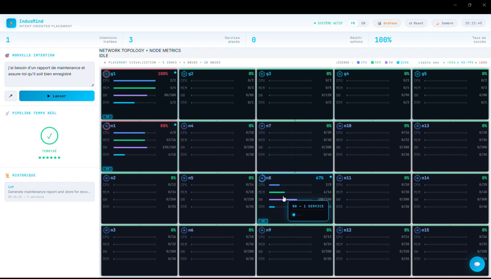

# IndusMind — Voice-Driven Edge Service Placement

Academic project built by a team of 3. IndusMind turns a **voice or text command in natural language** (e.g. *"I want to replace the power unit of machine 3"*) into a **concrete service placement decision on an Edge infrastructure**, taking into account available resources (CPU, memory, disk, bandwidth) and quality-of-service constraints (latency).

## Objective

Simulate an industrial operator able to:
1. Understand an intent expressed in natural language (voice or text)
2. Match it against a known intent in a pattern base (via RAG + LLM)
3. Decide where to deploy the corresponding services on an Edge/Gateway node network, under resource and QoS constraints
4. Visualize everything in a real-time dashboard

## Architecture

```
Input (voice/text)
      │
      ▼
[voice_to_json.py]      Whisper  → LLM summary (Mistral) → structured intent
      │
      ▼
[matching_rag_v3.py]     RAG (embeddings + cosine similarity) → LLM rerank → LLM fallback
      │  (relies on cache_manager.py for the embeddings cache)
      ▼
[placement_multiagent_v2.py]   Multi-agent pipeline:
      │   Agent 1 — Resource Manager  (available capacity per node)
      │   Agent 2 — QoS Analyzer      (latency/bandwidth constraints)
      │   Agent 3 — Placement Master  (LLM-based decision + validation + greedy fallback)
      │  (relies on placement_knowledge.py: base of reusable placement patterns)
      ▼
[etat_manager.py]        System state persistence (deployed services, remaining resources)
      │
      ▼
[app.py]                 Real-time Flask dashboard (SSE) + InfluxDB/Grafana integration
```

## Tech stack

- **Local LLM**: Mistral via [Ollama](https://ollama.com/)
- **Speech-to-Text**: [faster-whisper](https://github.com/guillaumekln/faster-whisper)
- **Embeddings**: `nomic-embed-text` (Ollama)
- **Backend**: Python, Flask, Server-Sent Events (SSE) for real-time updates
- **Monitoring** (optional): InfluxDB + Grafana
- **Frontend**: HTML/JS (network visualization dashboard)

## How to run

### Prerequisites
- Python 3.11+
- [Ollama](https://ollama.com/) installed, with the following models pulled:
  ```bash
  ollama pull mistral
  ollama pull nomic-embed-text
  ```

### Setup
```bash
python -m venv venv
source venv/bin/activate  # Windows: venv\Scripts\Activate.ps1
pip install -r requirements.txt
```

### (Optional) InfluxDB configuration
To enable metrics export to InfluxDB:
```bash
export INFLUXDB_TOKEN="your_token"   # Windows: $env:INFLUXDB_TOKEN="your_token"
```
Without this variable, the dashboard runs normally; only the InfluxDB export is disabled.

### Run
```bash
python app.py
```
Then open [http://localhost:5000](http://localhost:5000) in a browser.

## Screenshot



## My contribution

This project was built by a team of 3 as part of an academic project (PFA). I personally designed and implemented the following modules:

- **`matching_rag_v3.py` + `cache_manager.py`** — Intent-matching pipeline: embeddings cache (50x faster than the previous version), cosine-similarity search, a 3-tier decision process (direct RAG / LLM rerank / LLM fallback), and validation/logging of matched intents.
- **`placement_multiagent_v2.py` + `placement_knowledge.py`** — Multi-agent placement pipeline: a resource-management agent, a QoS-analysis agent, and a final LLM-based decision agent (with malformed-JSON repair and a greedy fallback on failure), plus a knowledge base of reusable placement patterns across similar intents.
- **`voice_to_json.py`** — Voice-processing chain: audio capture, Whisper transcription, Mistral summarization, and structuring/saving of collected intents.
- **`etat_manager.py`** — System state persistence and consistency checks across restarts.

